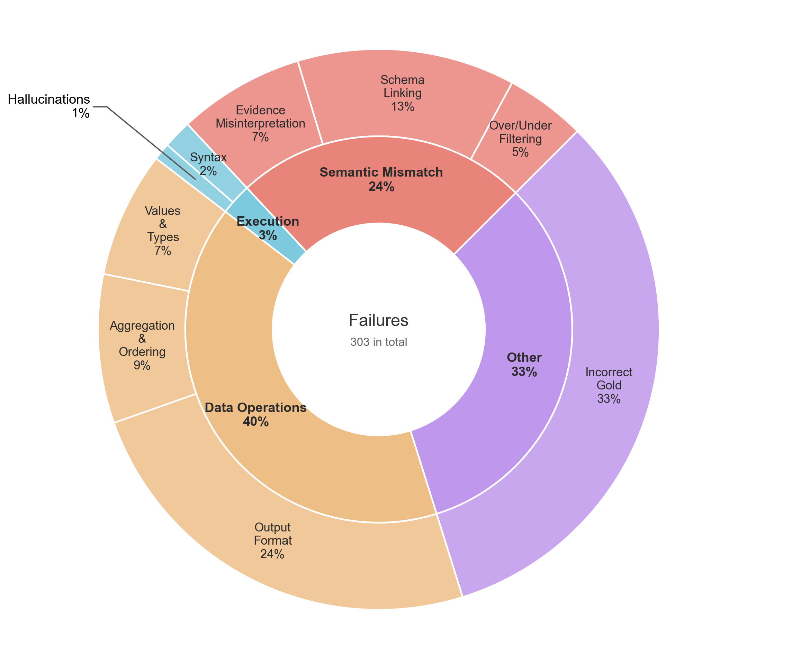
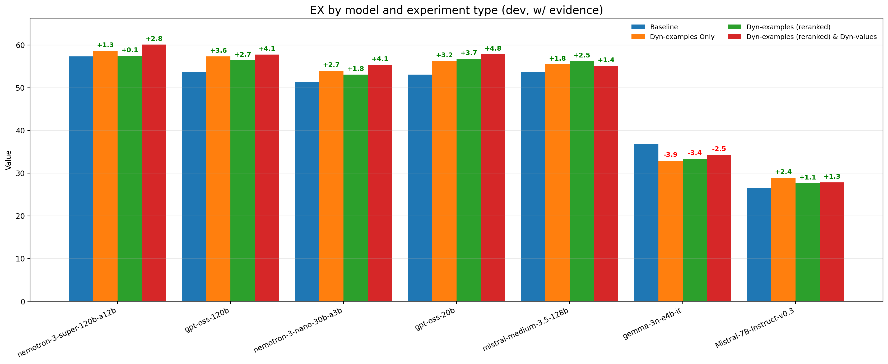
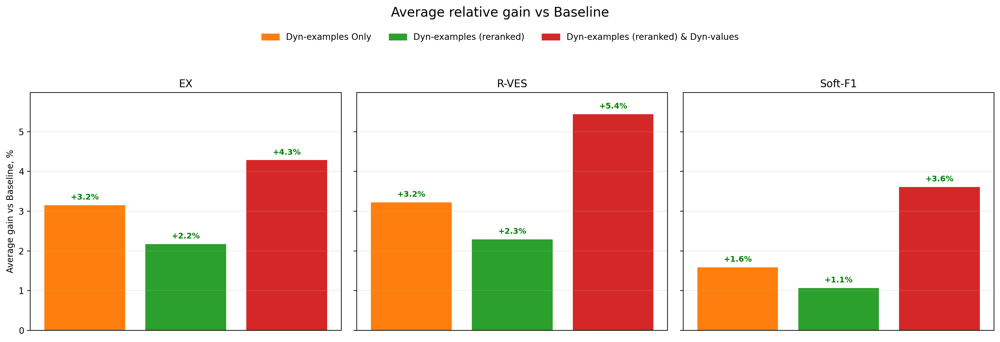
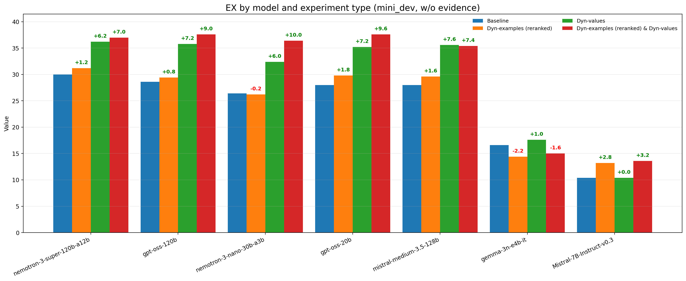
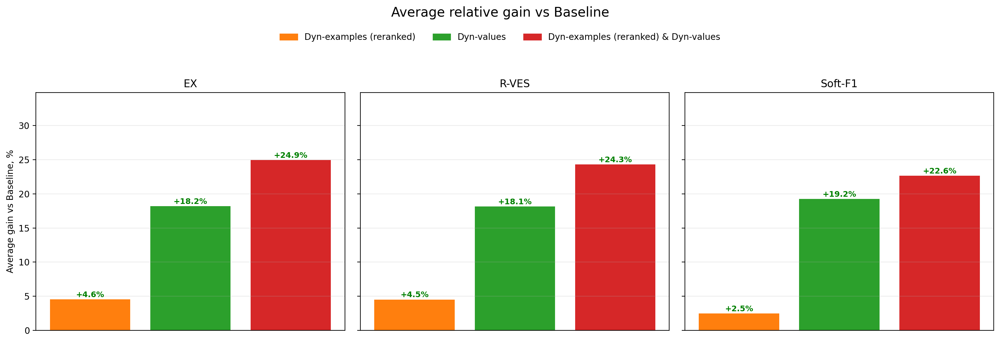
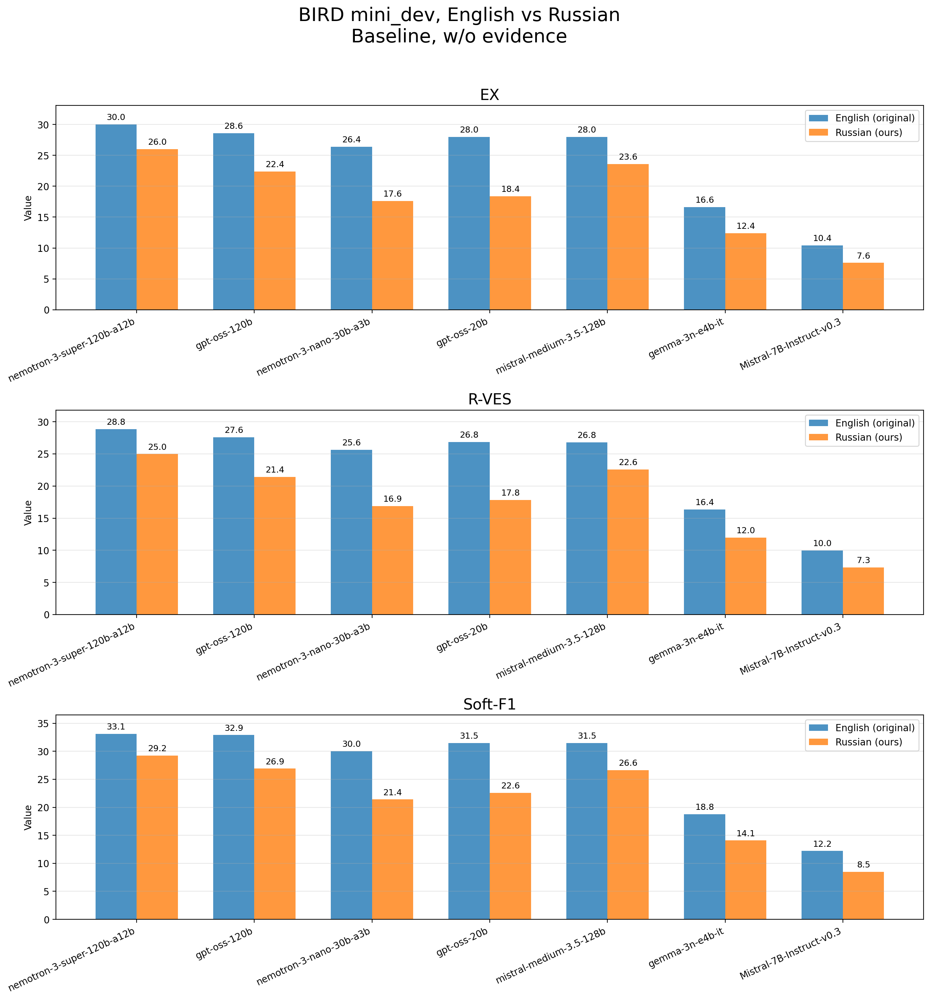
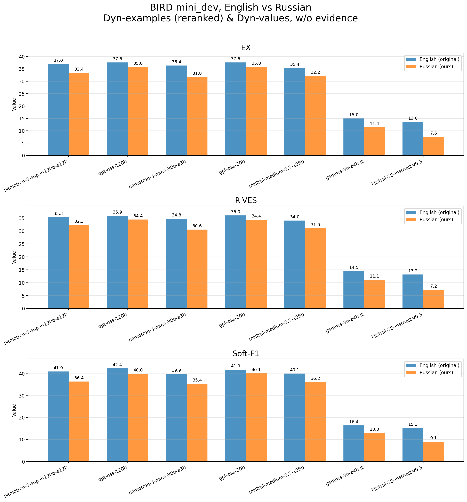

# Text-to-SQL RAG method to address semantic mismatch problem

[![CC BY-SA 4.0][cc-by-sa-shield]][cc-by-sa]
[](https://www.python.org/downloads/)

[cc-by-sa-shield]: https://img.shields.io/badge/License-CC%20BY--SA%204.0-lightgrey.svg

> **This project is originally derived from the [BIRD mini_dev repository](https://github.com/bird-bench/mini_dev) and partially utilizes its scripts and evaluation framework. Modifications and bug fixes were made to the original mini_dev scripts to support the current research. We would like to express our gratitude to the authors of the BIRD benchmark for their valuable contribution to the community. If you use the BIRD dataset or this repository source code in your research, please check `Citation` chapter at the end of current README.md. [BIRD-bench and leaderboard](https://bird-bench.github.io/)**

The repository contains scripts and research results for RAG approaches to address the semantic mismatch problem in Text-to-SQL problem. Two approaches are being investigated:
- Dynamic examples of question-answer pairs from the training dataset. This approach uses hybrid search with optional ML reranking (BM25 + vector search, combined via RRF pipeline). For our research we used BGE-m3 embedder and BGE-reranker-v2-m3 as search result reranking model.
- Dynamic search for similar values in the database to correct the filtering clauses in SQL query. This approach uses semantic search (BGE-m3 embedder) with pre-filtering by database, table and column.

The results are stored in the `artifacts` folder. Additionally, an analysis of errors on the BIRD mini_dev dataset has been conducted (`artifacts/error_analysis.png`, `artifacts/gpt-oss-120b_mini_dev_annotated.json`), and a comparison has been made with the manually translated version of BIRD mini_dev, which we have named `mini_dev_ru_mod`. [Link to the mini_dev_ru_mod repository](https://github.com/korostast/bird_mini_dev_ru_mod).

## Quick Start

Follow these steps to reproduce the research results.

1. Run the setup script to initialize submodules, virtual environment and download the required datasets (will take up to 15 GB).
    ```bash
    bash setup.sh
    source .venv/bin/activate
    ```

2. The project uses OpenSearch 3.6.0 for indexing and retrieval. Start the required services using docker compose:
    ```bash
    docker compose up --build -d --pull always --wait
    ```

3. To generate SQL queries using an LLM, use the `run_gpt.sh` script. Results will be saved to `data_kg_output_path` (defaults to `./mini_dev/llm/exp_results/mini_dev`)

    **Note:** You will need to configure your API keys and URLs within the script before running. Scripts for deploying an embedder, reranker, or LLM are not included with this repository and must be deployed separately using the OpenAI Compatible API (you can use provider APIs for this purpose, such as [NVIDIA NIM](https://build.nvidia.com/)). Please, navigate to the `run_gpt.sh` script and configure necessary variables.

    > Key variables in `run_gpt.sh`:
    > - `eval_path`: Path to dataset (json containing questions and gold answers).
    > - `db_root_path`: Path to database sources.
    > - `llm_models`, `llm_api_keys`, `llm_urls`: Configuration for the LLM provider. Required.
    > - `opensearch_url`, `embedder_url`, `reranker_url`: Endpoints for the infrastructure services.
    > - `dynamic_examples_few_shot`: Enable/disable dynamic few-shot example retrieval via OpenSearch. **Requires embedder configuration. ALSO NOTE: this step initiate data indexing. Indexing can take a couple of minutes, depending on the speed of the embedder. If you do not want to do it each time, then comment out corresponding `if` section.**
    > - `rerank_dynamic_few_shots`: Enable/disable reranking of retrieved examples. **Requires reranker configuration.**
    > - `dynamic_value_few_shots`: Enable/disable dynamic value retrieval for the prompt. Drastically changes text-to-sql pipeline and do 1-2 additional LLM API calls. **NOTE: this step initiate data indexing. Indexing can take a long time, up to several hours, depending on the speed of the embedder. If you do not want to do it each time, then comment out corresponding `if` section.**
    > - `use_knowledge`: Add evidence (external knowledge) to LLM prompt.

    ```bash
    bash mini_dev/llm/run/run_gpt.sh
    ```

    If you want to use mini_dev_ru_mod (Russian version of mini_dev dataset), then specify `eval_path=${PROJECT_ROOT}/data/mini_dev_ru_mod/mini_dev_ru_mod.json`.

 4. To evaluate the generated SQL queries, use the `run_evaluation.sh` script. Results will be saved to `./mini_dev/evaluation/eval_results/` by default.

    **Note:** Update the `predicted_sql_path` variable inside the script to point to your results.

    > Key variables in `run_evaluation.sh`:
    > - `predicted_sql_path`: Path to the JSON file containing the LLM-generated SQL queries.
    > - `db_root_path`: Path to databases. Note that mini_dev and dev databases are interchangeable.
    ```bash
    bash mini_dev/evaluation/run_evaluation.sh
    ```

## Metrics

The research uses the following metrics to evaluate the performance of the Text-to-SQL models:

1. EX (Execution Accuracy)
    Calculated by executing the predicted SQL query and the ground truth SQL query on the target database. If the result sets of both queries are identical (regardless of the order of rows), the prediction is considered correct.

2. R-VES (Reward-based Valid Execution Score)
    Evaluates not only the correctness of the result but also the efficiency of the predicted SQL. It assigns a reward based on the execution time ratio between the ground truth and the predicted query, rewarding queries that are as efficient as or more efficient than the ground truth.

3. Soft-F1
    A more lenient metric than EX that calculates an F1 score based on the overlap of result rows. It uses a row-matching mechanism to provide a partial score when the predicted result set is similar but not identical to the ground truth. All metrics are reported for different difficulty levels of the BIRD mini_dev dataset:
    - Simple
    - Moderate
    - Challenging
    - Total (Overall Accuracy)

## Results (EX)

> Refer to `artifacts/README.md` to see other results.

We ran the Baseline pipeline with evidence enabled in prompt on gpt-oss-120b (reasoning='medium' by default) and malually analyzed the model errors on the BIRD mini_dev dataset. The error distribution turned out to be as follows (each error example can belong to several classes at once):



**Error categories**:
- Semantic Mismatch
    - `Evidence Mistinterpretation`: Ignoring or misinterpreting an external knowledge (Evidence).
    - `Schema Linking`: A false reference to the schema is the selection of a table or column that does not correspond to the business logic of the user's question.
    - `Over/Under Filtering`: Excessive filtering (adding implicit strict conditions) or omitting necessary restrictions in the WHERE block.
- Data Operations:
    - `Output Format`: The system returned an answer in a different format than the gold answer was expected in.
    - `Aggregation & Ordering`: Discrepancies in the logic of grouping and errors in extracting extremes (the difference between the subquery with MAX and ORDER BY ... LIMIT 1 if there are identical values).
    - `Values & Types`: Filtering by incorrect column values in string constants (for example, 'premium' instead of 'Premium'), date formats mismatch, or lack of type conversion (CAST).
- Execution:
    - `Hallucinations`: Accessing non-existent tables, aliases, or columns.
    - `Syntax`: SQLite syntax errors.
- Other:
    - `Incorrect Gold`: The question does not match the gold answer and can be considered as a noise question.

Next, we ran experiments on 7 LLM models using various RAG approaches. We set temperature to 0, max_tokens=8192, reasoning - default model settings. We use NVIDIA NIM API as an LLM provider. According to NVIDIA developers, the models are deployed via vLLM.

**Models**:
- [nvidia/nemotron-3-super-120b-a12b](https://huggingface.co/nvidia/NVIDIA-Nemotron-3-Super-120B-A12B-BF16): NVIDIA MoE reasoning model released on March 11, 2026.
- [nvidia/nemotron-3-nano-30b-a3b](https://huggingface.co/nvidia/NVIDIA-Nemotron-3-Nano-30B-A3B-BF16): A lite-weight version of NVIDIA nemotron-3 model that was released on December 15, 2025. Also supports reasoning by default.
- [openai/gpt-oss-120b](https://huggingface.co/openai/gpt-oss-120b): An OpenAI MoE (5.1B active parameters) open-source reasoning model released on August 5, 2025.
- [openai/gpt-oss-20b](https://huggingface.co/openai/gpt-oss-20b): A lite-weight version of OpenAI gpt-oss model that was released on August 5, 2025. Also supports reasoning by default.
- [mistralai/mistral-medium-3.5-128b](https://huggingface.co/mistralai/Mistral-Medium-3.5-128B): A dense transformer model designed to unify general reasoning, vision, and coding capabilities. **Non-reasoning by default**. Was released on April 29, 2026.
- [mistralai/Mistral-7B-Instruct-v0.3](https://huggingface.co/mistralai/Mistral-7B-Instruct-v0.3): A non-reasoning dense model released on May 22, 2024.
- [google/gemma-3n-e4b-it](https://huggingface.co/google/gemma-3n-E4B-it): A multimodal (text, image, audio) instruction-tuned non-reasoning model with a 4B active parameter (8B parameters overall) released on June 26, 2025.

With 'evidence' (external knowledge) included in LLM prompt results are not shiny. E.g. on mini_dev RAG methods of dynamic examples and dynamic value search gived around +4% of EX gain.

At the same time, the results on small models (SLM - Small Language Model, in the framework of this study we will consider models up to 7B parameters) are unstable and the RAG approach can even lead to performance drop in metrics.




However, 'evidence' gives the LLM a cheat sheet of understanding the database structure for **each** query. Such expert knowledge is unlikely to be present in real-world Text-to-SQL scenarios. Therefore, we conducted experiments without adding evidence to the prompt of the model and found that the RAG approach allows for a significantly better understanding of the data structure.

In this task setting, the approach of dynamically generating the prompt and fixing the SQL query using dynamically searched values in the database results in an EX gain of up to 25% compared to the Baseline. However, the Baseline itself experiences a significant decrease of almost two times compared to the same Baseline with evidence included in the prompt. This demonstrates that the RAG approach significantly reduces the impact of semantic mismatch issues on the system's performance.




In addition, we translated the questions from the BIRD mini_dev dataset into Russian and uploaded them to the mini_dev_ru_mod repository. Our experiments show the following interesting facts (evidence is not included in the prompt):
1. When switching from English to Russian, the Baseline approach loses up to 35% in terms of EX (see the first plot below).
2. The RAG approach with dynamic prompting and searching for similar values in the database can significantly reduce the gap between understanding data in different languages (see the second plot below).
3. The results on SLM are also unstable.




## Citation

If you use the BIRD dataset in your research, please cite the original paper:

```bibtex
@article{li2024can,
  title={Can llm already serve as a database interface? a big bench for large-scale database grounded text-to-sqls},
  author={Li, Jinyang and Hui, Binyuan and Qu, Ge and Yang, Jiaxi and Li, Binhua and Li, Bowen and Wang, Bailin and Qin, Bowen and Geng, Ruiying and Huo, Nan and others},
  journal={Advances in Neural Information Processing Systems},
  volume={36},
  year={2024}
}
```

## LICENSE

This work is licensed under a
[Creative Commons Attribution-ShareAlike 4.0 International License][cc-by-sa].

[cc-by-sa]: http://creativecommons.org/licenses/by-sa/4.0/
